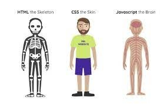
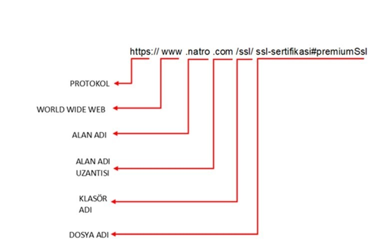

# 1- Web Temelleri ve Html

## 🔗 Linkler

- [İnternet Nasıl Çalışıyor](https://youtu.be/QQGbDpcXEbk)
- [Bilgisayar Devrimi - 1](https://www.youtube.com/watch?v=z3fZBwJhn4g)
- [Bilgisayar Devrimi - 2](https://www.youtube.com/watch?v=kKMV73S6ePk)
- [Http ve Https farkı nelerdir?](https://aws.amazon.com/tr/compare/the-difference-between-https-and-http/)
- [Url nedir?](https://tr.wikipedia.org/wiki/URL)
- [Dns nedir?](https://tr.wikipedia.org/wiki/DNS)
- [Konsol Komutları nelerdir?](https://pchocasi.com.tr/cmd-komutlari-68308/)
- [Ide Nedir?](https://aws.amazon.com/tr/what-is/ide/)
- [w3schools Html](https://www.w3schools.com/html/)
  
## 📦 Ders İçeriği

- osi katmanı
- ip ve ip türleri
- dns
- url
- http vs https
- html vs css vs js
- vscode extensionları ve farklı ideler
- emmet
- lorem ipsum nedir
- html tagleri
  - html
  - body
  - head
  - meta
  - title
  - h1, h2...
  - p
  - div
  - span
  - img
  - a
  - ul, ol, li
  - form, label, input
- inline style ve css
- block ve inline elements [w3schools](https://www.w3schools.com/html/html_blocks.asp)
- attributelar
- w3schools
- klasör yapısı (path ve project structure)

## 📸 Fotoğraflar

html css js  
  

url nedir?

[<< Anasayfa](../../readme.md)
